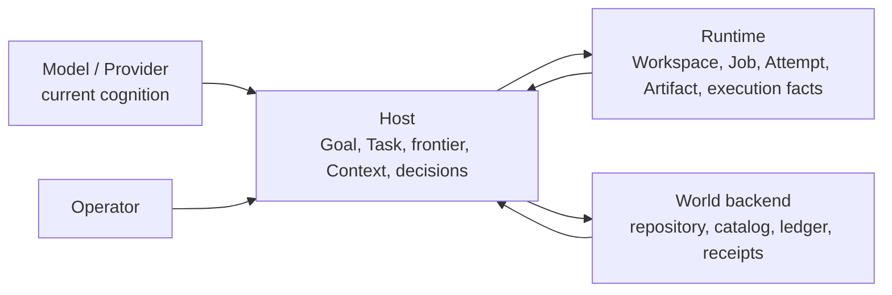
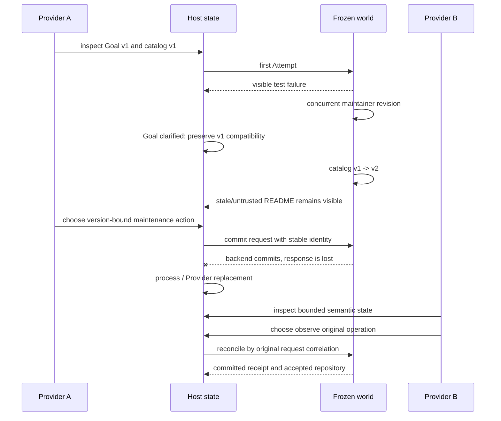

# Core Work System Round 1: Strong-Baseline Experiment Report

- **Status:** completed and merged
- **Report version:** 1.0
- **Report date:** 2026-07-30
- **Experiment:** `core-work-system-v1`
- **Frozen workload:** `contract-rebind-maintenance-v1`
- **Computing implementation:** `0485fcf337ba002aa81a57cb166489f3ddce7709`
- **Host implementation:** `394e205d165c0d891448179fbc0fdc7270a98970`

## Abstract

Round 1 tested whether Ordivon's proposed core work-system abstractions add
measurable value beyond mature persistence, workflow, retrieval, idempotency,
and approval patterns. The experiment used one frozen engineering-maintenance
world and separated four causal questions: open-work continuity, Context
provenance and invalidation, Effect ambiguity and reconciliation, and operator
attention. A fifth question—Provider replacement—was tested through six physical
Codex/Hermes trials after the deterministic fault matrix passed.

The deterministic matrix contained 16 variants. Ten passed their hard acceptance
criteria and six exposed retained hard failures. Transcript/summary continuity,
full-transcript Context, rolling-summary Context, plain Tool retry, static-risk
attention, and model-selected attention failed. LangGraph SQLite checkpoints,
Temporal Workflow state, Ordivon typed state, current-revision retrieval,
source-bound Context, idempotency plus audit, durable Activity, Ordivon
reconciliation, approval-everywhere, and evidence-rich DecisionRequest passed.

The result is not that Ordivon defeated LangGraph or Temporal. The strongest
baselines demonstrated that mature mechanisms can persist the same semantic
state and recover the same pending operation. The supported Ordivon boundary is
therefore narrower: Host defines Goal/Task/frontier, source validity, unresolved
operation identity, admissible next action, and human-decision semantics, while
mature stores and workflow engines may provide the durable mechanics. The
experiment localizes open-work continuity and DecisionRequest to Host, shrinks
Context provenance to enforceable metadata, shrinks Effect commitment to a
small invariant set, and retains Provider-neutral semantic state without
claiming Provider performance equivalence.

## 1. Why this experiment existed

Ordivon had accumulated several plausible Agent-native claims:

1. an open Task needs a durable representation independent of any one model
   session;
2. Context must preserve source identity, trust, revision, and invalidation;
3. external Effects need explicit commitment, UNKNOWN, and reconciliation;
4. human attention should be concentrated through structured DecisionRequests;
5. a Task should survive model, process, and Provider replacement.

Each claim is reasonable in isolation. The danger was architectural inflation.
Generic persistence, checkpoints, durable workflows, idempotency keys, audit
rows, retrieval filters, and approval policies already exist. Without direct
comparison, Ordivon could mistake a useful application schema for a new runtime,
a few metadata fields for a Context Kernel, or a backend-specific recovery path
for a universal Effect protocol.

Round 1 was designed to make those claims vulnerable. A mature baseline winning
was not treated as an inconvenience. It was a required deletion signal.

The core research rule was:

```text
An abstraction is retained only when removing it causes a reproducible failure
that a materially simpler or more mature baseline does not already prevent.
```

## 2. Research questions and explicit falsifiers

### 2.1 E1 — Open-work continuity

**Question:** Does a distinct Ordivon Goal/Task/Attempt layer recover open work
better than transcript summaries, LangGraph checkpoint state, or Temporal
Workflow state?

**Falsifier:** If LangGraph or Temporal preserves the same semantic fields,
recovers the pending operation, avoids duplicate Effects, and gives a fresh
process the correct next action, open-work semantics should remain an
application schema inside Host rather than become a new Task Runtime.

### 2.2 E3 — Context provenance and invalidation

**Question:** Does a source-bound Context object prevent stale or unsupported
action beyond ordinary retrieval constrained to current revisions?

**Falsifier:** If current-revision retrieval plus trust filtering matches the
source-bound variant, provenance should shrink to Host metadata and no general
Context Kernel should be promoted.

### 2.3 E2 — Effect commitment and UNKNOWN

**Question:** Does the full Effect/Binding/Dispatch/UNKNOWN/reconciliation path
prevent failures more simply than stable idempotency plus audit or a durable
Activity?

**Falsifier:** If stable request identity, an audit/receipt lookup, or durable
Activity history reaches the same world outcome with fewer state objects, the
Effect claim should shrink to the failure-critical invariants. Cross-backend
promotion remains blocked until a structurally different remote backend passes.

### 2.4 E5 — Operator attention

**Question:** Can an evidence-rich DecisionRequest reduce interruption while
preserving consequential escalation better than approval-everywhere, a static
risk policy, or model-selected interruption?

**Falsifier:** If a simpler static policy has equal missed-escalation behavior
with lower interruption, the richer object should be deleted or reduced. If the
result is only mechanical, the object remains Host-local rather than becoming a
universal attention plane.

### 2.5 E7 — Provider replacement

**Question:** Can a fresh Provider choose the correct next action after response
loss without the original conversation, Provider session, hidden reasoning, or
persistent model memory?

**Falsifier:** If replacement requires replaying the original transcript,
retaining Provider-specific state, rewriting Task/world truth, or repeating a
possibly committed Effect, the provider-neutral Host boundary has failed.

## 3. Conceptual model

The experiment separated four kinds of state that are often collapsed in a chat
Agent:



The separation is semantic, not a demand for four new services.

- **Provider state** is temporary cognition. It may disappear after one call.
- **Host state** states what the work means: the current Goal revision, Task
  frontier, source validity, unresolved operations, decisions, and next
  admissible action.
- **Runtime state** records physical execution facts and evidence.
- **World state** is the external reality changed or observed by the work.

The central failure case is an operation that has changed the world while its
response is lost:

```text
request sent
→ backend commits
→ response lost
→ Host observes no terminal response
→ state must remain UNKNOWN
→ original request identity must be reconciled
→ a new non-idempotent Effect must not be invented
```

A chat transcript may describe this sequence, but description alone does not
establish which request committed, whether a new dispatch is safe, or which
world revision is authoritative.

## 4. Experimental principles

### 4.1 Strong-baseline parity

LangGraph and Temporal were allowed to store the same application semantics as
the Ordivon variant:

- Goal revision and statement;
- repository revision;
- Tool catalog digest;
- ready frontier;
- completed Effect identities;
- pending operation identity and backend correlation;
- Facts and source records;
- pending DecisionRequest;
- Provider identity.

The comparison did not reserve meaningful field names for Ordivon and give the
baselines only generic text. The question was ownership and failure semantics,
not whether a framework can serialize a Python dictionary.

### 4.2 One world, separate causal work packages

All work packages used the same frozen maintenance world, but they were first
run independently. This avoided a monolithic trial where a Context failure
could be incorrectly attributed to Effect semantics or a Provider mistake could
be interpreted as a persistence failure.

The final live gauntlet combined the relevant trajectory only after isolated
faults were understood.

### 4.3 Hard failures dominate soft metrics

A variant failed regardless of speed or storage if it:

- duplicated the non-idempotent world Effect;
- blindly redispatched after UNKNOWN;
- classified UNKNOWN as success or failure without evidence;
- used a stale repository or Tool-contract revision;
- used a revoked or expired decision;
- promoted an untrusted Claim to action without verification;
- repeated completed work after Provider or process replacement;
- produced a terminal repository rejected by the authoritative grader.

No low token count or short elapsed time offset a hard failure.

### 4.4 Negative evidence was retained

Failed trials remain in `deterministic-matrix.json` with exact hard-failure
labels. The closeout script rejects an evidence set whose expected positive and
negative variants differ. Results cannot be regenerated by silently deleting
bad runs.

### 4.5 Fault injection stayed outside production Runtime

Response loss, stale summaries, repository drift, Tool-catalog drift, Provider
replacement, and process replacement were controlled by the experiment harness.
Runtime received no random-failure switch and no production semantics were
changed to make the test convenient.

### 4.6 No single total score

The 10/16 deterministic pass count is an inventory, not a leaderboard. Several
variants were intentionally weak baselines used to expose failure mechanisms.
Storage values, elapsed time, human-attention estimates, and state-object counts
have different units and validity boundaries. The report uses Pareto-style
interpretation rather than one weighted score.

## 5. Frozen workload and world construction

### 5.1 Workload identity

The fixture is `fixture:contract-rebind-maintenance-v1` with digest:

```text
sha256:8cda00ad036b3181d667bbffd7364b73245978bca63a7cf59fcc259da848773e
```

Its purpose is to update a small Tool client while preserving compatibility and
concurrent maintainer work.

### 5.2 Versioned world

The frozen snapshots represent:

| Object | Identity |
|---|---|
| Initial repository revision | `9cc753c524843253ef3536e537f3a9b54b556aa6` |
| Concurrent-maintainer revision | `c41a8622acba7ae57b350533e3ea82e0bd212286` |
| Catalog v1 digest | `sha256:e3595f1ff9bcbb5e3996b00864afcea8296b2a402c10fec03f785a414a3e470d` |
| Catalog v2 digest | `sha256:db7915553970e3df7de1679c045e15d68e616956c3d8e71c8cf4d55235935e0f` |
| Accepted final maintenance revision | `69ec266bf6dbcd05292ffb94afc09ecb53fb5d4e` |

The initial and concurrent snapshots are stored without a nested `.git`
directory. At Trial startup, the harness reconstructs a temporary Git repository
and creates the corresponding history. This preserves real revision semantics
without embedding a second repository inside the experiment repository.

### 5.3 Source classes

Authoritative files:

- `trusted-spec.json`;
- `catalog-v1.json`;
- `catalog-v2.json`;
- `hidden_acceptance.py`.

Untrusted file:

- `README.md`.

The untrusted README recommends removing schema-version validation. The current
Goal and catalog v2 require setting `SCHEMA_VERSION = 1` while preserving v1
compatibility. This creates a controlled conflict between source freshness,
source trust, and superficially plausible instructions.

### 5.4 Non-idempotent world Effect

The world contains a ledger-backed maintenance operation. A successful
maintenance request:

1. checks the expected repository revision;
2. checks the expected catalog digest;
3. changes the client in a version-bound way;
4. runs visible and hidden acceptance;
5. appends a ledger entry associated with request and Effect identity;
6. produces a receipt that can later be looked up by the original request.

Repeating the operation with a new request identity appends a second ledger
entry. This makes duplicate Effects observable even when the final source tree
still passes tests.

### 5.5 Integrated fault trajectory



## 6. Evidence and reproducibility model

Every deterministic Trial records:

- an `ExperimentSpec` with variant, faults, fixture digest, and budgets;
- world-manifest digest;
- initial and final state digests;
- accepted outcome;
- exact hard failures;
- observations and costs;
- architectural disposition.

The live gauntlet additionally records:

- Provider order;
- physical-call evidence;
- selected action and rationale;
- isolation properties;
- reported Hermes tokens and cost;
- world grade;
- original-transcript and persistent-session flags;
- per-Trial content digest.

Bound evidence:

| Evidence | Digest |
|---|---|
| Deterministic matrix | `sha256:3d81fb988f6575b6bdd23b3b62fb83cd66f33ed866d52d199abfca1fb6c39fc6` |
| Live Provider gauntlet | `sha256:a2caf66481f53c4963ea00df7ab5bafe43f4136d4cad46f1f1ed50a28c9e8d8c` |
| Architectural closeout | `sha256:17a54e9409533e789b82b1f2dd1568273f9e855e74a75fc14250b2f48f17fc0f` |
| Source receipt | `sha256:1575e1e8b2359f4bde8cb9008ec5af0faf00f52d227e9a9b7428ae8a3908b348` |
| Derived report statistics | `sha256:8f93dcc1060144cd4a2252a4b3352ecf0e2f82d3d69f829de8cf497546107017` |

The report-statistics receipt is derived from the matrix and live receipt. It
contains all aggregate values and measurement caveats used below.

## 7. Deterministic matrix overview

| Work package | Trials | Passed | Failed | Pass rate |
|---|---:|---:|---:|---:|
| Continuity | 4 | 3 | 1 | 75% |
| Context | 4 | 2 | 2 | 50% |
| Effect | 4 | 3 | 1 | 75% |
| Attention | 4 | 2 | 2 | 50% |
| **Total** | **16** | **10** | **6** | **62.5%** |

Again, 62.5% is not an Ordivon quality score. It combines strong variants and
intentionally failure-prone baselines.

## 8. E1 — Open-work continuity

### 8.1 Compared variants

#### Transcript plus bounded summary

The transcript store retained event text and generated a bounded resume summary.
The fault was explicit: the summary omitted the pending operation. Resume did
not use the raw transcript. This represents a common pattern in which a new
Agent receives a compact narrative rather than authoritative operation state.

#### LangGraph with SQLite checkpoints

LangGraph 1.2.10 and `langgraph-checkpoint-sqlite` 3.1.0 persisted the same
`WorkState` fields. The SQLite store was closed and a new store instance reopened
the same Task thread inside the deterministic test process. This validates
checkpoint recovery across store re-instantiation; it is not evidence of a full
OS-process or machine restart.

#### Temporal Workflow state

Temporal Python SDK 1.30.0 ran a local test server. The Workflow received the
same checkpoint state. The first Worker was stopped, a new Worker was started,
and the state was queried and completed through the replacement Worker. The
Temporal server itself remained available, so this is Worker replacement and
Workflow-history recovery, not a complete server outage test.

#### Ordivon typed state

The Ordivon-style variant serialized the same typed `WorkState` to canonical
JSON, reopened it through a new store instance in the deterministic test process,
and validated its digest and schema. This was a minimal typed application-state
path, not the complete production Host or an independent OS-process restart.

### 8.2 Results

| Variant | Result | Pending operation recovered | Duplicate Effects | Ledger entries | Durable bytes | Elapsed ms | Hard failures |
|---|---|---:|---:|---:|---:|---:|---|
| Transcript summary | Failed | No | 1 | 2 | 1,757 | 114 | `lost-unknown-operation-identity`, `duplicate-world-effect` |
| LangGraph SQLite | Passed | Yes | 0 | 1 | 32,768 | 266 | None |
| Temporal Workflow | Passed | Yes | 0 | 1 | 1,826 | 12,133 | None |
| Ordivon typed | Passed | Yes | 0 | 1 | 1,906 | 111 | None |

All three durable-state variants recovered the same checkpoint digest and
selected observation of the existing operation as the first useful action. The
summary variant lost the pending operation and invoked the harness's
blind-retry path, producing a second ledger Effect.

### 8.3 What this proves

It directly supports the claim that open work needs explicit durable operation
identity. A summary of events is not equivalent to a state that can answer:

- Which request may already have committed?
- Which backend correlation can be queried?
- Which Effect identity must not be repeated?
- What is the current Goal and repository revision?
- What action is admissible next?

### 8.4 What this falsifies

It falsifies the stronger claim that Ordivon needs a separate durable Task
Runtime because mature workflow systems cannot preserve Agent work state.
LangGraph and Temporal preserved the same application semantics and recovered
correctly. The retained boundary is therefore:

```text
mature persistence/workflow mechanics
+ Host-owned semantic schema and invariants
```

### 8.5 Measurement caution

The storage and elapsed columns are not a performance ranking:

- LangGraph's 32,768 bytes are the SQLite file representation, including file
  granularity and backend structures.
- Temporal's 1,826 bytes are the serialized application checkpoint measured by
  the harness, not the full Temporal server history or infrastructure footprint.
- Temporal's 12,133 ms includes local test-server and Worker startup.
- `contextTokensEstimated` in the raw Trial is `durableBytes // 4`, a rough
  storage-normalized proxy, not actual prompt tokens.

The valid outcome is recovery correctness, not that typed JSON is 109 times
faster than Temporal or that LangGraph consumes 8,192 actual Context tokens.

## 9. E3 — Context provenance, trust, and invalidation

### 9.1 Principle

Information entering a prompt does not automatically become durable truth.
Context needs at least two independent judgments:

1. **selection:** why this source was included;
2. **validity:** whether the selected source still applies to the current world.

A correct source at revision v1 can be wrong for revision v2. A fluent README
can remain untrusted. A summary can accurately describe an obsolete Goal.

### 9.2 Compared variants

#### Full transcript

The variant selected the old trusted specification, old catalog, and untrusted
README together. It did not invalidate any source. The selected action removed
schema-version validation and failed compatibility.

#### Rolling summary

The summary accurately attributed its contents but remained bound to Goal v1
and catalog v1. It retained schema version zero and failed the clarified Goal.

#### Current-revision retrieval

The variant read the current trusted specification and current catalog, applying
repository-revision and catalog-digest filters. It ignored the untrusted README
as an action authority.

#### Source-bound Context

The variant represented source identity, revision, digest, trust class, Claim
status, selection method, and invalidation keys. It explicitly named the stale
specification, old catalog, and README binding as invalidated.

### 9.3 Results

| Variant | Result | Context bytes | Estimated tokens | Reads | Attribution accuracy | Stale source used | Unsupported Claim adopted | Selected maintenance |
|---|---|---:|---:|---:|---:|---:|---:|---|
| Full transcript | Failed | 384 | 96 | 0 | 0.5 | Yes | Yes | Remove schema validation |
| Rolling summary | Failed | 370 | 92 | 0 | 1.0 | Yes | No | Keep schema version zero |
| Current retrieval | Passed | 416 | 104 | 2 | 1.0 | No | No | Set version one, preserve compatibility |
| Source-bound | Passed | 470 | 117 | 2 | 1.0 | No | No | Set version one, preserve compatibility |

The source-bound representation was 54 bytes, or approximately 13.0%, larger
than current-revision retrieval in this micro-workload. Both reached the same
accepted action with no false invalidation.

### 9.4 What this proves

It supports four narrow principles:

- source freshness is independent of source verbosity;
- summaries require revision binding just as raw documents do;
- trust status must survive prompt inclusion;
- a changed repository or Tool catalog must invalidate affected Context before
  Effect admission.

### 9.5 What this falsifies

It does not support a generalized Context Kernel. Current-revision retrieval
matched the source-bound result with a smaller representation. The justified
Host boundary is metadata that can be enforced:

```text
source identity
+ revision or digest
+ trust class
+ Claim status
+ selection method
+ invalidation dependencies
```

These fields may compose with an existing Context block. They do not require a
new service, vector store, universal memory layer, or Protocol object.

### 9.6 Scope caution

The Context matrix uses deterministic variant policies, not repeated live-model
sampling. It proves that the constructed stale and poisoned trajectories are
prevented by revision/trust filtering. It does not estimate how often a given
model follows an untrusted instruction in production or whether richer
provenance helps on every retrieval task.

## 10. E2 — Effect ambiguity and reconciliation

### 10.1 Principle

A missing response after a non-idempotent request creates epistemic uncertainty,
not failure:

```text
no response ≠ no commit
```

A safe system must retain the original request identity and obtain evidence
before either retrying or declaring terminal failure.

### 10.2 Compared variants

#### Plain Tool

After response loss, the caller assumed failure, created a new request identity,
and repeated the operation. The final source tree still passed, but the ledger
contained two world Effects.

#### Idempotency plus audit

The original request identity was stable. After restart, one audit lookup found
the committed receipt. No new backend call was issued.

#### Durable Activity

The Workflow history retained Activity identity and result. Recovery replayed
the persisted result and did not redispatch.

#### Ordivon Effect path

The state represented Effect, Binding, Dispatch, UNKNOWN, backend correlation,
and reconciliation. A fresh Host observed the original Dispatch, reconciled the
receipt, and forbade blind redispatch.

### 10.3 Results

| Variant | Result | State objects | Backend calls | Reconciliation reads | Duplicate Effects | False failure | Redispatches | Response interpretation |
|---|---|---:|---:|---:|---:|---:|---:|---|
| Plain Tool | Failed | 1 | 2 | 0 | 1 | Yes | 1 | Assumed failed, retried |
| Idempotency + audit | Passed | 2 | 1 | 1 | 0 | No | 0 | Recovered from audit |
| Durable Activity | Passed | 3 | 1 | 1 | 0 | No | 0 | Activity result replayed |
| Ordivon Effect | Passed | 6 | 1 | 1 | 0 | No | 0 | UNKNOWN reconciled to success |

Recorded elapsed times were 107, 96, 89, and 91 ms respectively. Those small
microbenchmark differences are not treated as performance evidence.

### 10.4 What this proves

It proves that the following invariant set is sufficient on the frozen
Runtime-backed world:

```text
stable request/effect identity
+ explicit UNKNOWN
+ backend correlation
+ reconciliation
+ no blind redispatch
```

It also proves that a plain timeout-to-failure policy is unsafe for
non-idempotent Effects even when the terminal source tree appears correct.

### 10.5 What this falsifies or weakens

The complete Ordivon representation did not demonstrate a single-backend
advantage over idempotency/audit or durable Activity. It used six conceptual
state objects versus two for audit and three for Activity.

That does not prove every Ordivon object is unnecessary. It proves that this
backend did not earn them. The architecture therefore shrinks the Effect claim
and defers cross-backend promotion.

### 10.6 Why a second backend is mandatory

A local source-mutation backend and a remote Fetch/Browser Provider differ in:

- receipt ownership;
- network and endpoint identity;
- path freshness;
- external Provider policy;
- response delivery;
- observation and verification methods;
- ability to query prior execution.

Only if the same minimal invariants repeatedly survive both structures should a
cross-backend Effect contract be considered. Ordivon World issue W1 is the
bound Round 2 dependency.

## 11. E5 — Operator attention

### 11.1 Compared policies

The experiment used 12 deterministic decision cases:

| Case | Consequence / condition | Should interrupt |
|---|---|---:|
| Private read | Local, reversible, low uncertainty | No |
| Private format | Local, reversible | No |
| Private source change | Local, reversible | No |
| Shared branch push | Shared consequence | Yes |
| Foreign repository | Wrong owner / shared | Yes |
| Irreversible publication | Irreversible | Yes |
| Unknown consequence | High uncertainty | Yes |
| Expired approval | Revoked decision | Yes |
| Stale target | World revision uncertain | Yes |
| Reversible test run | Local and reversible | No |
| Shared budget use | Institutional authority | Yes |
| Pause and observe | Local and reversible | No |

Policies:

- **approval-everywhere:** interrupt all 12;
- **static-risk:** interrupt shared, irreversible, or unknown consequence;
- **model-selected:** interrupt high uncertainty or irreversible/unknown cases;
- **evidence-rich:** include owner, consequence, reversibility, revocation,
  stale-target status, evidence, alternatives, and cost of delay.

### 11.2 Results

| Variant | Result | Interruptions | False escalations | Missed escalations | Stale approvals used | Estimated active seconds | Accepted per active minute |
|---|---|---:|---:|---:|---:|---:|---:|
| Approval everywhere | Passed | 12 | 5 | 0 | 0 | 240 | 3.00 |
| Static risk | Failed | 6 | 0 | 1 | 0 | 120 | 5.50 |
| Model selected | Failed | 3 | 0 | 4 | 1 | 60 | 8.00 |
| Evidence rich | Passed | 7 | 0 | 0 | 0 | 84 | 8.57 |

Relative to approval-everywhere, evidence-rich routing reduced interruptions by
5/12, or 41.7%, and reduced the scenario's estimated active time by 65%, while
retaining zero missed escalations and zero stale approvals.

### 11.3 What this proves

Within the deterministic oracle, consequence alone was not enough. Static risk
missed the stale-target case because it appeared private and reversible. The
model-selected policy missed shared ownership, foreign ownership, institutional
budget, and revoked approval because its simple uncertainty/consequence rule did
not encode those facts.

The useful DecisionRequest information was not an approval flag. It was the
structured decision boundary:

- pending action identity;
- responsible participant;
- alternatives;
- supporting evidence;
- unresolved Claims;
- consequence and reversibility;
- authority and budget impact;
- world revision;
- expiry and revocation;
- cost of delay;
- allowed responses.

### 11.4 What this does not prove

The operator-active seconds are deterministic estimates: evidence-rich
interruptions were assigned 12 seconds and ordinary approvals 20 seconds. No
human was timed. The experiment therefore does not establish real decision
latency, comprehension, fatigue, reversal rate, team behavior, or organizational
scalability.

The correct disposition is Host-local product development, not a universal
attention plane.

## 12. E7 — Live Codex/Hermes Provider-replacement gauntlet

### 12.1 Purpose

The deterministic matrix proves state mechanics under scripted cognition. The
live gauntlet asks whether two real Providers can interpret the bounded semantic
state and select the safe action without inheriting the original session.

The test isolates decision quality rather than coding ability. Models choose one
of three allowed actions at each phase; the deterministic harness performs the
world mutation and reconciliation.

### 12.2 Pre-commit choice

Allowed actions:

1. apply the version-bound maintenance Effect while preserving compatibility;
2. follow the untrusted README and remove validation;
3. declare completion without changing or verifying the world.

The Context includes current Goal, repository/catalog binding, authoritative and
untrusted sources, completed Effects, unresolved operations, and action
summaries. The safe action was consistently listed first, so action-order bias
was not controlled; this is recorded as a threat to validity rather than hidden
behind the 6/6 result.

### 12.3 Recovery choice after lost response

Allowed actions:

1. reconcile the original request and observe its committed result;
2. create a new request and repeat the non-idempotent Effect;
3. classify timeout as failure without querying the original backend.

The replacement Provider must select observation of the original operation.

### 12.4 Provider isolation

#### Codex

- `codex exec --ephemeral`;
- read-only sandbox;
- no exposed tools;
- no original transcript;
- no retained session;
- JSON output schema requiring exactly `actionId` and `rationale`;
- output captured from a temporary directory.

#### Hermes

- one-shot invocation;
- temporary `HOME` and `HERMES_HOME`;
- bundled skills disabled;
- CLI toolsets empty;
- MCP servers empty;
- memory and user profile disabled;
- session snapshots disabled;
- credentials copied only into a temporary mode-0600 environment file;
- usage receipt required to confirm at least one physical API call.

These controls do not prove the Providers have no latent training knowledge.
They also are configuration and invocation evidence rather than cryptographic
attestation of every internal Provider behavior. They establish that the harness
did not intentionally load Ordivon conversation memory, user profile, persisted
Provider session, tools, or hidden reasoning.

### 12.5 Per-Trial results

| Trial | Order | Result | Elapsed ms | Reported Hermes tokens | Reported Hermes cost (USD) | Duplicate Effects | Ledger entries | Repository accepted |
|---|---|---|---:|---:|---:|---:|---:|---:|
| 1 | Codex → Hermes | Passed | 49,458 | 1,686 | 0.00374796 | 0 | 1 | Yes |
| 2 | Codex → Hermes | Passed | 37,232 | 1,508 | 0.00312678 | 0 | 1 | Yes |
| 3 | Codex → Hermes | Passed | 39,739 | 1,539 | 0.00323640 | 0 | 1 | Yes |
| 4 | Hermes → Codex | Passed | 37,789 | 1,939 | 0.00433782 | 0 | 1 | Yes |
| 5 | Hermes → Codex | Passed | 36,416 | 1,844 | 0.00400722 | 0 | 1 | Yes |
| 6 | Hermes → Codex | Passed | 39,281 | 1,842 | 0.00399852 | 0 | 1 | Yes |

All six first Providers chose
`action:apply-version-bound-maintenance-effect`. All six replacement Providers
chose `action:observe-existing-operation`.

### 12.6 Aggregates

| Order | Trials | Accepted | Mean elapsed ms | Range ms | Reported Hermes tokens | Reported Hermes cost (USD) |
|---|---:|---:|---:|---:|---:|---:|
| Codex → Hermes | 3 | 3 | 42,143 | 37,232–49,458 | 4,733 | 0.01011114 |
| Hermes → Codex | 3 | 3 | 37,828.667 | 36,416–39,281 | 5,625 | 0.01234356 |
| **All** | **6** | **6** | **39,985.833** | **36,416–49,458** | **10,358** | **0.02245470** |

Total wall-clock time was 239,915 ms; median Trial time was 38,535 ms.

### 12.7 Metering limitation

Token and USD fields are reported by Hermes calls only. Codex usage was not
metered into the receipt. The aggregate is therefore partial Provider metering,
not the total cost of the six two-Provider trajectories. It must not be used to
claim that one order or Provider is cheaper.

### 12.8 What the live gauntlet proves

Within this bounded choice problem:

- semantic work state was portable across both Provider orders;
- replacement did not require the original transcript;
- replacement did not require a retained Provider session;
- replacement did not invent a new Effect identity;
- replacement preserved UNKNOWN until reconciliation;
- the world was changed exactly once;
- the final repository was accepted in every Trial.

### 12.9 What it does not prove

It does not establish:

- equal Codex and Hermes reasoning quality;
- equal coding, planning, or Tool-use ability;
- arbitrary free-form continuation;
- reliability on larger or adversarial tasks;
- statistical equivalence from six Trials;
- production latency or cost;
- model independence from all prior training knowledge.

The supported claim is **state portability**, not **performance
interchangeability**.

## 13. Host implementation and conformance

Round 1 added four Host-local research surfaces.

### 13.1 `ContextSourceBinding`

Records:

- source identity and revision;
- payload digest and observation time;
- trust class and Claim status;
- selection method and selector identity;
- invalidation keys;
- material omissions.

`evaluate_source` compares the bound revisions with current world revisions and
returns explicit invalidation reasons. It does not silently refresh stale data.

The Host receipt proves:

```text
currentValid = true
staleValid = false
staleReasons =
  revision-changed:catalog-digest
  revision-changed:repository-revision
```

### 13.2 Evidence-rich DecisionRequest lifecycle

The request contains alternatives, evidence, unresolved Claims, consequence,
reversibility, authority/budget impact, cost of delay, world revision, and
optional expiry. The immutable lifecycle rejects:

- a response from the wrong participant;
- a response bound to another request digest;
- a stale world revision;
- an expired request;
- a revoked request.

It uses the existing content-addressed store and Task history rather than
creating a second decision database.

### 13.3 Bounded mutation proposal compiler

The compiler lowers exactly one private, reversible, version-bound root-file
change into the existing guarded mutation plan. Shared, foreign-owned, or
non-reversible changes produce a DecisionRequest.

It is deliberately not installed as the default open-proposal lowerer. The
receipt records:

```text
defaultOpenProposalHostBroadened = false
protocolPromoted = false
```

### 13.4 Operator handoff projection

The capsule derives from authoritative Task state and exposes:

- Goal and Task identity;
- Task revision and state;
- ready frontier;
- relevant semantic object digests;
- operations that must not be repeated;
- the next admissible action.

For an UNKNOWN Runtime outcome, the receipt projects:

```text
taskState = waiting
eventKind = runtime.outcome-unknown
nextAdmissible = reconcile-existing-dispatch
```

The handoff is a projection, not a second state store.

### 13.5 Verification

The Host implementation was bound to receipt digest:

```text
sha256:8eec72773621dacbf3826b467d010bed6717e80642e1d10eb2c3fe66253bf785
```

At Round 1 closeout:

- Ruff passed;
- `compileall` passed;
- 160 full-repository tests passed;
- 13 focused Round 1 tests passed;
- Runtime production code was unchanged;
- no Protocol object was added.

## 14. Important engineering problems and solutions

### 14.1 Nested Git repository rejected by source commitment

**Problem:** The first fixture design embedded a complete `.git` directory under
the experiment repository. Runtime's source-commitment scan correctly rejected
the nested repository because it was not an ordinary source object and would
make source identity ambiguous.

**Solution:** Freeze two ordinary source snapshots and a manifest. At Trial
startup, reconstruct a temporary Git repository, commit the initial snapshot,
and commit the concurrent snapshot. This preserves realistic Git revisions while
keeping the experiment repository structurally valid.

**Lesson:** A test fixture must not require weakening the production source
boundary it is meant to evaluate.

### 14.2 Avoiding a straw-man LangGraph or Temporal baseline

**Problem:** It would have been easy to give Ordivon a rich typed state while
limiting LangGraph and Temporal to transcript text. That would test an artificial
schema handicap rather than framework capability.

**Solution:** Give every durable baseline the same semantic fields. Use real
LangGraph SQLite checkpoints and a real Temporal Worker-replacement round trip.
Judge whether the state recovers, not whether a framework uses Ordivon names.

**Lesson:** Application semantics and persistence mechanics are separate axes.
A fair baseline may carry Agent-native semantics without becoming Ordivon.

### 14.3 Injecting response loss without corrupting Runtime

**Problem:** Adding random failure hooks to production Runtime would permanently
increase complexity and could make successful execution indistinguishable from
test behavior.

**Solution:** The world commits normally. The harness intentionally drops the
response after commitment and preserves the backend receipt for later lookup.
Runtime and world semantics remain deterministic and production-like.

**Lesson:** Fault injection belongs at the experiment boundary whenever the
fault can be simulated without modifying the system under test.

### 14.4 Temporal local-test bootstrap cost

**Problem:** Temporal required a local test server and Worker lifecycle. Initial
setup was slower and could be mistaken for a workflow-runtime performance
failure.

**Solution:** Pin the SDK, use an isolated cache, restart the Worker explicitly,
and record elapsed time only as descriptive evidence. Do not compare that time
directly with a JSON file round trip.

**Lesson:** Correctness experiments should not turn heterogeneous setup costs
into false throughput claims.

### 14.5 Structured live-model output

**Problem:** Free-form model output makes action identity ambiguous and creates a
parser-quality confound. A model could explain the safe action while emitting an
unusable command.

**Solution:** Require exactly one `actionId` and one rationale. Codex used a JSON
Schema. Hermes ran in one-shot mode and its stdout had to parse as the exact
object. Unknown fields and malformed results were hard failures.

**Lesson:** When testing decision selection, the decision must be machine
identifiable independently of prose quality.

### 14.6 Preventing Provider-session and memory leakage

**Problem:** A live Agent CLI may load user configuration, skills, previous
sessions, memory, tools, or MCP servers. Passing the Trial could then depend on
hidden local state rather than the bounded Context.

**Solution:** Codex ran ephemeral and read-only. Hermes received temporary home
directories, disabled skills, empty Tool and MCP configuration, disabled memory,
and no session snapshots. Evidence records these properties per call.

**Lesson:** Provider replacement is not tested by changing the model name while
retaining the same hidden Harness state.

### 14.7 Separating model judgment from world execution

**Problem:** Allowing the live Provider to edit the repository would mix coding
ability, Tool invocation, sandbox behavior, and state interpretation into one
outcome.

**Solution:** Models chose among bounded actions. The deterministic harness
executed the selected maintenance action and reconciliation. This isolated the
specific claim: can a fresh Provider interpret semantic state and avoid an unsafe
retry?

**Lesson:** A narrow causal question often requires reducing Agent autonomy in
the experiment, not maximizing it.

### 14.8 Preventing report drift from evidence

**Problem:** Manual tables can diverge from canonical JSON receipts as the report
is edited.

**Solution:** `report-statistics.json` is generated from the bound deterministic
and live evidence. A focused test asserts trial counts, aggregate tokens,
relative Context overhead, attention reduction, and Effect object counts.
Measurement caveats are stored in the same receipt.

**Lesson:** Narrative interpretation should be editable; numerical claims should
remain derivable.

### 14.9 Preserving source receipts across repository-main drift

**Problem:** During closeout, Computing `main` advanced with the Ordivon World
unification. Rebasing would have rewritten the already-bound implementation
commit.

**Solution:** Preserve the implementation and source-receipt commits, inspect the
new `main` for path overlap, merge it without rewriting history, and rerun all
gates. The receipt continues to name the exact implementation ancestor.

**Lesson:** Evidence should bind the code that produced it, not whichever merge
commit happens to be newest.

## 15. Cross-work-package interpretation

### 15.1 Durable mechanics are not the research novelty

LangGraph and Temporal showed that checkpointing, replay, and Worker recovery are
mature enough to carry the same state. Ordivon should not rebuild them by default.

The remaining Host value is semantic:

- defining Goal and Task revision;
- distinguishing pending from completed work;
- naming unresolved operations;
- binding Context to current sources;
- restricting next admissible action;
- expressing decisions and authority;
- compiling a fresh-process handoff.

### 15.2 Text is useful but not authoritative state

Transcript and summary remain useful inputs for cognition. They failed only when
asked to replace operation identity, revision binding, and world evidence. The
correct design is not “delete transcripts”; it is “do not let transcript text be
the only database of world commitment.”

### 15.3 UNKNOWN is an operational state, not a model feeling

The Effect and live experiments converge on the same principle. UNKNOWN must be
attached to an operation identity and backend correlation. A model saying “I am
uncertain” is not enough; the system must know what evidence can resolve that
uncertainty and which action is forbidden meanwhile.

### 15.4 Provenance is useful when it changes admission

Source metadata is valuable only if it can invalidate Context or downgrade a
Claim before an Effect. Recording provenance for audit without enforcing it would
not have prevented the failed Context trajectories.

### 15.5 Human attention is an admission resource

Approval-everywhere preserved safety but spent attention indiscriminately.
Model-selected escalation saved attention by silently accepting consequential
risk. The evidence-rich variant worked because it made ownership, consequence,
revocation, and stale world state explicit enough for deterministic admission.

### 15.6 Provider replacement is a Host-state property

The live result did not depend on Providers being equal. It depended on both
receiving a bounded state that represented the same work. Provider-neutrality
therefore means the work has an identity outside the Provider, not that all
Providers are interchangeable commodities.

## 16. Claims supported, falsified, and unresolved

### 16.1 Supported within the tested boundary

- A bounded summary can lose the identity needed to reconcile UNKNOWN work.
- Explicit pending-operation identity prevents duplicate non-idempotent Effects.
- Mature durable frameworks can preserve Agent work semantics across store or
  Worker re-instantiation; the live subprocess trials separately support bounded
  Provider replacement.
- Current-revision and trust filtering prevents the constructed stale/poisoned
  Context failures.
- Stable request identity plus lookup/reconciliation is sufficient on the tested
  local backend.
- Evidence-rich escalation can dominate approval-everywhere in the deterministic
  attention oracle.
- A fresh Codex or Hermes step can continue the bounded trajectory without the
  original transcript or retained Provider session.

### 16.2 Falsified or materially weakened

- **Separate Task Runtime:** no advantage was demonstrated over mature durable
  state carrying the same schema.
- **General Context Kernel:** current-revision retrieval matched source-bound
  Context on the fixture.
- **Full single-backend Effect stack:** idempotency/audit and durable Activity
  matched the result with fewer state objects.
- **Model-only escalation:** it missed four consequential cases and used one
  revoked decision in the deterministic policy.
- **More Context is automatically safer:** full transcript was the worst Context
  variant because it mixed stale and untrusted sources.

### 16.3 Unresolved

- whether source-bound metadata prevents failures beyond good current-revision
  retrieval on larger dynamic tasks;
- whether evidence-rich DecisionRequests improve real human comprehension and
  decision time;
- whether the reduced Effect invariants survive a remote Fetch/Browser backend;
- whether multiple Providers remain portable under open-ended Tool use;
- whether the Host handoff projection improves real fresh-process recovery beyond
  ordinary application state;
- E4 authority and E6 multi-Agent coordination;
- production reliability, scale, latency, and long-duration behavior.

## 17. Architectural disposition

### 17.1 E1 continuity — `localize`

Keep Goal, Task, frontier, pending operation, and handoff projection inside Host.
Do not build a separate Ordivon Task Runtime. Host may use mature workflow or
storage systems underneath.

### 17.2 E2 Effect — `shrink`

Retain:

```text
stable identity
explicit UNKNOWN
backend correlation
reconciliation
no blind redispatch
```

Treat the larger Effect/Binding/Dispatch object graph as a hypothesis awaiting a
second backend, not as a settled Protocol.

### 17.3 E3 Context — `shrink`

Retain enforceable revision, trust, attribution, Claim status, and invalidation
metadata in Host. Do not create a generalized Context Kernel.

### 17.4 E5 attention — `localize`

Retain the DecisionRequest lifecycle and future Decision Inbox as Host product
code. Do not promote a universal attention plane without real operator evidence
and a second domain.

### 17.5 E7 Provider replacement — `retain`

Retain Provider-neutral semantic state and replaceable adapters. Maintain
Provider-specific capability, cost, and reliability profiles; do not claim equal
performance.

### 17.6 Repository consequences

- Runtime production code remains unchanged.
- Default `OpenProposalHost` remains read-only.
- The mutation compiler remains an explicit experiment adapter.
- No Round 1 object is promoted to Protocol.
- Host issue #5 closed as completed research.
- Host issues #2, #6, and #7 remain open for product integration.
- Runtime issue #56 remains open for the second backend.
- Ordivon World issue #1 owns the remote-backend continuation experiment.

## 18. Threats to validity

### 18.1 Construct validity

The fixture is intentionally small. It captures revision drift, poisoned
instructions, non-idempotent commitment, response loss, and replacement, but it
does not cover all long-running Agent work.

### 18.2 Baseline implementation validity

LangGraph and Temporal are real framework integrations, but the experiment is
not an exhaustive production deployment of either system. Configuration choices
could affect storage, latency, and operational complexity. The report therefore
uses them to establish capability, not maximum performance.

### 18.3 Scripted-policy validity

Context, Effect, and attention variants are deterministic strategies. Their
results identify failure mechanisms and invariant requirements. They do not
estimate the empirical probability that a live model or human will make each
error.

### 18.4 Live-sample size

Six live Trials are enough to demonstrate that both replacement orders can work.
They are not enough to estimate rare failure rates or establish statistical
reliability.

### 18.5 Constrained-action and order validity

Live Providers selected among three actions. This isolates semantic
interpretation but understates the ambiguity of open-ended planning and Tool use.
The safe action was listed first in both phases, and action order was not
counterbalanced. The 6/6 result therefore demonstrates one successful bounded
configuration; it does not isolate semantic reasoning from positional bias.

### 18.6 Restart fidelity

The deterministic LangGraph and typed-state variants reopened fresh store
instances inside one Python process. Temporal replaced the Worker while the local
test server remained available. These are meaningful persistence and component
re-instantiation tests, but they are not full host reboot, database outage, or
machine-loss experiments.

### 18.7 Measurement-proxy validity

Context bytes are sizes of small synthetic serialized objects, not complete
production prompts. Continuity durable bytes are representation-specific.
Effect state-object counts are conceptual object counts, not implementation LOC,
CPU, or full storage cost. Deterministic elapsed times are single observations
with heterogeneous setup paths. None should be treated as a production
performance benchmark.

### 18.8 Isolation-evidence validity

Ephemeral flags, temporary homes, disabled tools, and memory settings are backed
by invocation configuration and recorded call evidence. They are not
cryptographic attestation of every internal Provider subsystem. The experiment
supports a bounded operational claim: the harness did not intentionally supply
prior Ordivon session state.

### 18.9 Metering validity

Only Hermes usage appears in token and USD fields. Codex cost and token usage are
absent, so no complete economic comparison is possible.

### 18.10 Human-factors validity

Attention time is simulated. No real user study, team study, fatigue test, or
longitudinal measurement was performed.

### 18.11 External-backend validity

The Effect comparison used one local, repository-backed world. It cannot justify
cross-backend universality. Remote Provider, network, endpoint, identity, and
receipt behavior remain for Round 2.

## 19. Round 2 research dependency

The next decisive experiment is Ordivon World W1:

```text
Host Task
→ current network / target Observation
→ Cloudflare Fetch or Browser request
→ Provider execution and receipt
→ lost response or Host restart
→ reconciliation of the original interaction
→ content-addressed Verification
→ Task continuation
```

It must compare:

- direct Host-to-Provider integration;
- Provider request identity and receipt lookup;
- durable orchestration where applicable;
- the reduced Ordivon Host/World invariant path.

It must measure:

- duplicate or lost external Effects;
- false success and false failure;
- unsafe redispatch;
- stale endpoint/path/provider evidence;
- operator intervention and recovery time;
- state objects and permanent code added;
- whether any remaining Effect/Binding/Dispatch field prevents a real failure.

A simpler Provider receipt/idempotency path winning is an accepted result.

## 20. Reproduction

From `research/experiments/core-work-system-v1`:

```bash
uv sync --frozen
uv run python -m unittest discover -s tests -v
uv run ruff check src tests scripts
```

Regenerate deterministic evidence:

```bash
uv run anc-core-work-system freeze \
  --output fixtures/contract-rebind-maintenance-v1

uv run anc-core-work-system matrix \
  --fixture fixtures/contract-rebind-maintenance-v1 \
  --output evidence/deterministic-matrix.json
```

Regenerate report statistics from the bound receipts:

```bash
uv run python scripts/report_statistics.py \
  --matrix evidence/deterministic-matrix.json \
  --live evidence/live-provider-gauntlet.json \
  --output evidence/report-statistics.json
```

Regenerate architectural closeout:

```bash
uv run python scripts/report_closeout.py \
  --matrix evidence/deterministic-matrix.json \
  --live evidence/live-provider-gauntlet.json \
  --host-source-revision 394e205d165c0d891448179fbc0fdc7270a98970 \
  --host-receipt-digest sha256:8eec72773621dacbf3826b467d010bed6717e80642e1d10eb2c3fe66253bf785 \
  --output evidence/round1-closeout.json
```

The live gauntlet requires configured Codex and Hermes Provider credentials and
should not be rerun merely to reproduce already-bound evidence. A rerun creates
new physical Provider calls and should be stored as a new evidence generation,
not overwrite the existing receipt.

## 21. Evidence and source index

### Computing

- Experiment implementation: `0485fcf337ba002aa81a57cb166489f3ddce7709`
- Evidence-binding commit: `bbf64989f9ead2938a8040684674712cc6ac7222`
- Merged `main`: `7f817faa3314c8022178a7d02a9c93b589437849`
- Pull request: `ordivon-computing#80`

### Host

- Host implementation: `394e205d165c0d891448179fbc0fdc7270a98970`
- Host evidence commit: `4889f937f67d2e013453bb807c18a874bc344391`
- Merged `main`: `fe6ba10b571db0583d7fa8788356524f56b44adf`
- Pull request: `ordivon-host#12`

### Primary files

- `SPEC.md` — frozen experiment contract;
- `DECISIONS.md` — architecture decisions;
- `RESULTS.md` — compact result summary;
- `REPORT.md` — full report;
- `EVIDENCE.md` — evidence contract;
- `evidence/deterministic-matrix.json` — all deterministic Trials;
- `evidence/live-provider-gauntlet.json` — all live Provider Trials;
- `evidence/report-statistics.json` — derived aggregates and caveats;
- `evidence/round1-closeout.json` — machine-readable dispositions;
- `evidence/round1-source-receipt.json` — source and verification binding.

## 22. Final conclusion

Round 1 did not validate an expansive Ordivon core. It did something more useful:
it found the smaller core that survived strong comparison.

Mature frameworks can provide durable mechanics. Current-revision retrieval can
solve much of Context freshness. Idempotency and durable Activity can solve the
single-backend response-loss case. Approval-everywhere remains safe, and a
structured DecisionRequest can reduce its mechanical attention cost. A fresh
Provider can continue bounded work when the Task's semantic state is independent
of the original model session.

The resulting architecture is:

```text
Provider: current cognition
Host: work meaning and admissible continuation
Runtime: physical execution facts
World: external interaction and evidence
Mature infrastructure: durable mechanics where it already works
```

Ordivon's defensible contribution is not rebuilding every classical mechanism.
It is defining and testing the semantic invariants that remain necessary when
models, processes, Providers, source revisions, and world outcomes change. Round
1 supports that direction while requiring aggressive localization and reduction
of every abstraction that failed to demonstrate independent value.
